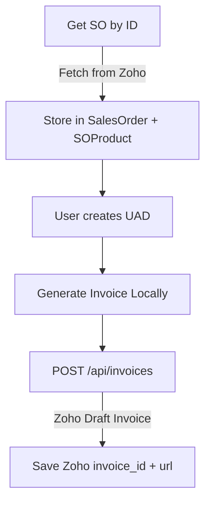

# 📄 UAD-Based Invoicing Application — Full Documentation

Stack: **Next.js + React + Tailwind** (frontend) | **Supabase/Postgres** (DB) | **Prisma** (ORM) | **Zoho Books API** (integration)

---

## 1. Database Schema (Prisma)

```prisma
// schema.prisma

generator client {
  provider = "prisma-client-js"
}

datasource db {
  provider = "postgresql"
  url      = env("DATABASE_URL") // Supabase/Postgres connection
}

//
// 👤 Users - basic authentication for employees
//
model User {
  id        String   @id @default(cuid())
  email     String   @unique
  name      String?
  password  String   // hashed password
  createdAt DateTime @default(now())

  // Relations
  salesOrders SalesOrder[]
  factories   Factory[]
  uads        UAD[]
  invoices    Invoice[]
}

//
// 📑 Sales Order - root record (fetched from Zoho Books)
//
model SalesOrder {
  id           String   @id @default(cuid())
  soNumber     String   @unique
  zohoSoId     String   // Zoho Books salesorder_id
  customerId   String   // Zoho Books customer_id
  customerName String
  startDate    DateTime
  endDate      DateTime
  billingCycle String   // "monthly" | "quarterly" | "halfyearly" | "yearly"
  billingDay   Int?     // only for monthly
  currencyCode String   @default("INR")
  createdAt    DateTime @default(now())

  // Relations
  createdBy   String
  user        User @relation(fields: [createdBy], references: [id])

  lineItems   SOProduct[]
  factories   Factory[]
  uads        UAD[]
  invoices    Invoice[]
}

//
// 🛒 SO Products - line items inside a Sales Order
//
model SOProduct {
  id         String   @id @default(cuid())
  zohoItemId String   // Zoho Books item_id
  name       String
  qtySo      Int
  rate       Float
  currency   String   @default("INR")

  soId       String
  salesOrder SalesOrder @relation(fields: [soId], references: [id])
}

//
// 🏭 Factory - allocations per SO
//
model Factory {
  id        String   @id @default(cuid())
  name      String
  notes     String?
  createdAt DateTime @default(now())

  soId      String
  salesOrder SalesOrder @relation(fields: [soId], references: [id])

  createdBy String
  user      User @relation(fields: [createdBy], references: [id])

  allocations FactoryAllocation[]
  uads        UAD[]
}

//
// 📦 Factory Allocations - subset of SO products
//
model FactoryAllocation {
  id          String   @id @default(cuid())
  zohoItemId  String   // match Zoho’s item_id
  productName String
  qtyFactory  Int
  rate        Float

  factoryId   String
  factory     Factory @relation(fields: [factoryId], references: [id])
}

//
// 📄 UAD - user acceptance docs
//
model UAD {
  id        String   @id @default(cuid())
  startDate DateTime
  endDate   DateTime
  status    String   @default("Draft") // Draft | Active | Ended
  notes     String?

  soId      String
  salesOrder SalesOrder @relation(fields: [soId], references: [id])

  factoryId String?
  factory   Factory? @relation(fields: [factoryId], references: [id])

  createdBy String
  user      User @relation(fields: [createdBy], references: [id])

  lineItems UADLineItem[]
  invoices  Invoice[]
}

//
// 📦 UAD Line Items - subset of Factory allocations
//
model UADLineItem {
  id          String   @id @default(cuid())
  zohoItemId  String   // Zoho Books item_id
  productName String
  qtyUad      Int
  rate        Float

  uadId       String
  uad         UAD @relation(fields: [uadId], references: [id])
}

//
// 💰 Invoice - generated per UAD per cycle
//
model Invoice {
  id        String   @id @default(cuid())
  externalInvoiceId String?   // Zoho Books invoice_id
  externalInvoiceNumber String? // e.g., "INV-000227"
  invoiceUrl String? // deep link to Zoho invoice
  invoiceDate DateTime
  cycleStart  DateTime
  cycleEnd    DateTime
  prorated    Boolean
  amount      Float
  breakdown   Json?   // proration details
  customFields Json?  // store Factory/UAD identifiers

  soId      String
  salesOrder SalesOrder @relation(fields: [soId], references: [id])

  factoryId String?
  factory   Factory? @relation(fields: [factoryId], references: [id])

  uadId     String
  uad       UAD @relation(fields: [uadId], references: [id])

  createdBy String
  user      User @relation(fields: [createdBy], references: [id])

  lineItems InvoiceLineItem[]
}

//
// 📊 Invoice Line Items - detailed quantities and rates
//
model InvoiceLineItem {
  id        String   @id @default(cuid())
  zohoItemId String   // Zoho Books item_id
  productName String
  qty       Float     // may be fractional (prorated)
  rate      Float
  lineAmount Float

  invoiceId String
  invoice   Invoice @relation(fields: [invoiceId], references: [id])
}
```

---

## 2. Calculation Spec

### Core Rules

* SO window: `SO.StartDate ≤ UAD.StartDate ≤ UAD.EndDate ≤ SO.EndDate`.
* Allocations:

  * Σ(Factory allocations) ≤ SO qty.
  * Σ(UAD qty in factory) ≤ factory allocation.
  * Σ(UAD qty across factories) ≤ SO qty.
* One invoice per UAD per cycle.
* Rates come from SO products.
* Full cycle = full rate.
* Partial cycle = prorated by days.
* Inclusive day counting.
* Final amount rounded **half-up, 2 decimals**.

### Cycle Rules

* **Monthly** → ends on BillingDay (or last day if month shorter).
* **Quarterly** → Mar 31, Jun 30, Sep 30, Dec 31.
* **Half-Yearly** → Jun 30, Dec 31.
* **Yearly** → 12 months from SO start.

### Formula

```
FullMonthAmount = Qty_UAD × Rate
Overlap = [CycleStart..CycleEnd] ∩ [UAD.Start..UAD.End] ∩ [SO.Start..SO.End]

If overlap == cycle → FullMonthAmount
Else → prorate by days:
   Fraction = ActiveDays / DaysInMonth
   MonthAmount = FullMonthAmount × Fraction
```

### Example

SO: 1-May → 31-Aug (Monthly D=15).
UAD: 10-May → 20-Jun, Qty=50, Rate=1000.

* 15-May → 6/31 × 50,000 = **₹9,677.42**
* 15-Jun → full = **₹50,000.00**
* 15-Jul → 5/30 × 50,000 = **₹8,333.33**
  **Total = ₹68,010.75**

---

## 3. UX/UI Spec (React + Tailwind)

### Page 1: Sales Order List

* Table of SOs (soNumber, customer, dates, billing cycle, counts, totals).
* Actions: View Details, +Add UAD.

### Page 2: Sales Order Detail

* Header card: SO info.
* Tabs:

  * **Factories** → allocations table.
  * **UADs** → timeline/list.
  * **Invoices** → list + breakdown.

### Page 3: Add Factory

* Form: Factory Name, Notes.
* Subform: product allocations.

### Page 4: Add UAD

* Form: Factory, Start/End, Notes.
* Subform: UAD line items (with dropdown → `zohoItemId`).

### Page 5: Invoices

* Table: invoice date, cycle, UAD, amount, prorated.
* Expand row → JSON breakdown.

### Page 6: Final Report

* Header summary.
* Factories list.
* UADs timeline.
* Invoices table.
* Totals at bottom.

---

## 4. API Layer Design

### `/api/zoho/refresh-token`

* POST → refreshes access token.
* Uses `.env` (`client_id`, `client_secret`, `refresh_token`).

Response:

```json
{ "access_token": "1000.xxxxx", "expires_in": 3600 }
```

---

### `/api/salesorders/:id`

* Fetch SO from Zoho → store in DB.
* Extract `zohoSoId`, `customerId`, line items (`item_id`, rate, qty).

---

### `/api/uads`

* Create UAD + line items.
* Run invoice generation logic.
* Store invoices locally (not pushed yet).

---

### `/api/invoices`

* POST → push local invoice to Zoho (draft mode).
* Payload:

```json
{
  "customer_id": "2031676000000056544",
  "custom_fields": [
    { "customfield_id": "2031676000008612118", "value": "Factory X" },
    { "customfield_id": "2031676000008612122", "value": "UAD-1001" }
  ],
  "line_items": [
    { "item_id": "2031676000000053663", "quantity": 3 }
  ]
}
```

* Response:

  * Save `invoice_id`, `invoice_number`, `invoice_url`.

---

## 5. Authentication

* `.env` stores Zoho OAuth credentials.
* App stores only latest access token in memory/cache.
* Users log in with email/password (local auth).
* Each record tracks `createdBy`.

---

## 6. API Flow Diagram


